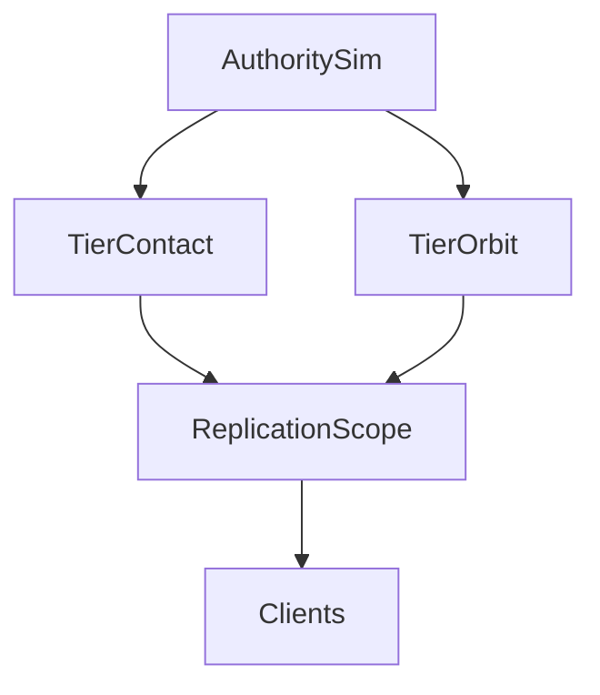

# Multiplayer-first physics and world scale (Dream-oriented planning)

**Status:** design guidance (non-normative). **Normative** rules remain in [ADR-0059](../decisions/ADR-0059-simulation-space-and-physics-tier-contract.md) (simulation space, physics tiers, handoff invariants H1–H3), [ADR-0060](../decisions/ADR-0060-multiplayer-data-plane-and-authority-constraints.md) (single physics authority, interest management, data plane), and [ADR-0054](../decisions/ADR-0054-online-multiplayer-authority-topology-baseline.md) (session topology and replication metadata baseline).

## North-star context (internal product: Dream)

**Dream** is a working name for a **multiplayer-first** direction: **spaceship racing** from **dense urban corridors** through **atmosphere** to **orbit** and beyond. That mix stresses:

- **High linear speed** and large **area-of-interest (AOI)** footprints per ship.
- **Tier transitions** between **contact / high-fidelity** simulation near surfaces and **cruise / orbital** motion off-surface ([ADR-0059](../decisions/ADR-0059-simulation-space-and-physics-tier-contract.md) patched-conics intent).
- **Many local props** (city clutter, hazards) plus **large visual events** (FX, debris, water interaction) without blowing **CPU, bandwidth, or tick** budgets.

This page ties those stresses to **replication**, **world generation**, and **physics scope** so engine and game code stay aligned with [`MASTER_PLAN.md`](../MASTER_PLAN.md) maintainer priorities.

## Authoritative vs presentation physics

- **Authority (server / host sim):** resolves outcomes that affect **fairness**—collisions with track bounds, weapon or hazard hits, moving obstacles that block the race line, and a **budgeted** set of dynamic bodies ([ADR-0060](../decisions/ADR-0060-multiplayer-data-plane-and-authority-constraints.md) bounded high-fidelity sim; [ADR-0059](../decisions/ADR-0059-simulation-space-and-physics-tier-contract.md) tier budget).
- **Clients:** may run **additional** local motion for debris, spray, and secondary props, then **softly reconcile** when authoritative events or snapshots arrive. Align with [MASTER_PLAN.md](../MASTER_PLAN.md) §4 *tiered destruction* (what the server authors vs client-local debris/FX).

## Replication taxonomy (template)

Before scaling player count, assign each **entity class** a row (spreadsheet or table in a future ADR):

| Column | Purpose |
| --- | --- |
| **Owner** | Authority sim only; or client-predicted then corrected. |
| **Sim class** | `static` / `sleepable` / `dynamic` / `cosmetic` (no gameplay effect). Chunk objects use [`ObjectSimulationClass`](../../engine/gameplay/WorldDataFormats.hpp) on [`ChunkObjectRecord`](../../engine/gameplay/WorldDataFormats.hpp). |
| **Update rate** | Full snapshot Hz vs throttled; tie to [`SessionConfig::snapshotHz`](../../engine/gameplay/OnlineMultiplayerFoundation.hpp) vs `simulationHz`. |
| **Channel** | Reliable (control, handoffs) vs unreliable (high-rate pose). |
| **Loss behavior** | Interpolate, freeze, or resync rule. |

**World streaming:** static layout and colliders should be **deterministic** from **chunk identity + seed + content version** ([`WorldDataFormats`](../../engine/gameplay/WorldDataFormats.hpp), [ADR-0050](../decisions/ADR-0050-world-chunk-data-object-references-and-queries-baseline.md)). Replicate **dynamic deltas** (destroyed panel, moved barrier), not full mesh payloads, when possible.

## Fast movers and interest management

Pure **position-radius AOI** is often insufficient at racing speeds.

- Prefer **velocity-aware** or **swept** interest (include entities along the motion corridor).
- For **cruise / orbit** tiers, consider **curve or keyframe segments** (short analytic arcs) instead of raw position at snapshot rate alone, consistent with [ADR-0059](../decisions/ADR-0059-simulation-space-and-physics-tier-contract.md) §5–6.
- Tune [`SessionConfig`](../../engine/gameplay/OnlineMultiplayerFoundation.hpp) `simulationHz`, `snapshotHz`, and `maxPredictionTicks` against ship speeds and acceptable extrapolation error.

## Tier handoffs as network events

When an entity moves between **contact** and **cruise/orbit** tiers, the **authority** should emit an explicit **handoff** message (reliable): pose, velocity in the **agreed inertial frame**, **tier id**, and **sim tick** (or time), so all peers satisfy **H1–H3** ([ADR-0059](../decisions/ADR-0059-simulation-space-and-physics-tier-contract.md)) and **no double integration** occurs. Visual smoothing may exceed physics smoothing only where H1–H3 still hold.

## Water and huge bodies

Default stance for multiplayer scale:

- **Authority:** coarse surface representation (e.g. heightfield or low-frequency field) plus **simple buoyancy, drag, and “in water” triggers** for bodies that matter to gameplay.
- **Client:** high-frequency normals, foam, and local wave detail driven by **parameters** updated at low rate.
- If **currents or swells** affect race outcome, replicate only **narrow degrees of freedom** (e.g. global phase + amplitude seeds), not a full fluid grid.

## Budgets (explicit caps)

Plan for hard caps and document them per mode:

- **Awake / simulated** rigid bodies on the authority ([ADR-0059](../decisions/ADR-0059-simulation-space-and-physics-tier-contract.md) tier intent).
- **Replicated entities** and **bytes per tick**, especially during “event” spikes (explosions, mass debris).
- **Interest set** size per peer ([ADR-0060](../decisions/ADR-0060-multiplayer-data-plane-and-authority-constraints.md) §4).

## SimulationIsland and replication

[`SimulationIsland`](../../engine/gameplay/SimulationIsland.hpp) and [`WorldPosition3`](../../engine/gameplay/SimulationIsland.hpp) are the natural seam for **large-world** consistency: peers must **agree** on anchor updates and on how **world-space** poses are encoded on the wire while **GPU and Jolt** stay on the local **float** island ([ADR-0059](../decisions/ADR-0059-simulation-space-and-physics-tier-contract.md)). **First wire layouts** (little-endian, fixed size): [`MultiplayerWireFormat.hpp`](../../engine/gameplay/MultiplayerWireFormat.hpp) (`writeSimulationIslandAnchor`, tier handoff, entity kinematics snapshot). Session rules for **when** the anchor moves remain game-level. **Transport baseline (landed):** [`IGameTransport`](../../engine/gameplay/GameTransport.hpp) loopback pair for tests, [`UdpGameTransport`](../../engine/gameplay/UdpGameTransport.hpp) + [`UdpSocket`](../../engine/platform/network/UdpSocket.hpp) for UDP/IPv4, session framing in [`MultiplayerSessionEnvelope.hpp`](../../engine/gameplay/MultiplayerSessionEnvelope.hpp) (magic/version, reliable control messages where applicable), and the [`mp_foundation`](../../game/mp_foundation/MpFoundationMain.cpp) sample: **raw UDP peer discovery** (first `Hello`) then [`AuthoritativeSession`](../../engine/gameplay/AuthoritativeSession.hpp) / [`ClientSession`](../../engine/gameplay/ClientSession.hpp) driving fixed-tick transport, **reliable** `HelloAck`, and periodic **unreliable** kinematics snapshots. This is **not** production netcode yet: no delta compression, no interest management in code, no NAT traversal.

## Authority to clients (overview)

## Next engineering steps (after this doc)

Ordered to match [MASTER_PLAN.md](../MASTER_PLAN.md) §1 / §4 and [sdk-and-samples-roadmap.md](sdk-and-samples-roadmap.md). Items **1–3 partial** are already in motion in code; **5–6 landed**; **7 partial** (interpolation helper landed; prediction/correction/wiring open); **8–9** remain the highest-ROI follow-ups for scale and measurable stats.

1. **Anchor / replication contract** — Specify (then implement) session-wide rules for [`SimulationIsland`](../../engine/gameplay/SimulationIsland.hpp) origin updates and `WorldPosition3` for entities crossing large distances. *(Policy + wire helpers exist; session-wide “when to rebase” rules still game-level.)*
2. **World determinism** — Chunk + seed + version yields identical static colliders for all peers; tag baked props with **simulation class** to cap server work and drive the replication taxonomy above.
3. **Transport** — [`IGameTransport`](../../engine/gameplay/GameTransport.hpp) + UDP/IPv4 + session envelope + localhost/LAN tests + `mp_foundation` sample **landed** ([ADR-0060](../decisions/ADR-0060-multiplayer-data-plane-and-authority-constraints.md) thin seam). **Still open:** NAT traversal/relay, internet-hardening, optional TLS/control-plane pairing.
4. **Minimal snapshots** — Fixed-layout kinematics and tier-handoff wire types + tests **landed**; delta compression, multi-entity bundles, and versioned schema evolution **open**.
5. **Phase 3 sample + authoritative session** — `mp_foundation` exercises **UDP localhost**: peer discovery via `receiveRaw`, then [`AuthoritativeSession`](../../engine/gameplay/AuthoritativeSession.hpp) / [`ClientSession`](../../engine/gameplay/ClientSession.hpp) for handshake (reliable `HelloAck`), snapshot ring buffer on the client, and framed kinematics at `snapshotHz`. **Landed:** same session classes (fixed-tick session manager, per-peer reliable channels, roster-driven connect/disconnect, snapshot emission); tested with loopback transport (`authoritative_session_test`) **and** real UDP in `mp_foundation`. **Still open:** headless standalone binary, visual **game** sample using the session classes, broader replicated state.
6. **Reliable control channel + sequencing** — **Landed:** [`ReliableChannel`](../../engine/gameplay/ReliableChannel.hpp) (per-peer sequence counter, 32-bit ack bitmap, fixed-capacity retransmit buffer); session envelope protocol version 2 with flags-byte reliable indicator, `Ack` and `Disconnect` message types, `writeSessionEnvelopeReliable` / `readReliableHeader` helpers; `HelloAck` sent reliably; tested (`reliable_channel_test`, `reliable_envelope_test`). Keep high-rate pose on unreliable UDP.
7. **Client presentation timeline** — Snapshot ring buffer **landed** (`ClientSession`). **Landed (narrow):** [`SnapshotInterpolator`](../../engine/gameplay/SnapshotInterpolator.hpp) — decoded frames keyed by server `simTick`, bracketing lerp for position/velocity, velocity extrapolation with tick clamp, `suggestRenderTick()` render-delay helper; tested (`snapshot_interpolator_test`, includes loopback decode from `ClientSession`). **Still open:** map client/render time to server tick (including fractional sub-tick), light prediction, explicit reconciliation/correction ([ADR-0060](../decisions/ADR-0060-multiplayer-data-plane-and-authority-constraints.md) §2), and wiring into `marbles` / visual sample.
8. **Interest management (AOI)** — Velocity-aware or swept AOI, per-entity update buckets, bytes-per-tick budgets ([ADR-0060](../decisions/ADR-0060-multiplayer-data-plane-and-authority-constraints.md) §4; replication taxonomy table above).
9. **Benchmarks and metrics** — Headless authority + synthetic clients; optional impairment (loss, jitter, reorder); export **p50/p95 RTT**, **snapshots/s**, **bytes/s per peer**, **packet loss %**, correction counts. Supports resume- and CI-friendly multiplayer stats.

### Optional and deferred

These are **not** part of the numbered priorities above; schedule when they pay off without blocking the main path.

| Item | When / why |
| --- | --- |
| **Handshake retry** | **Landed** in `ClientSession` (resends `Hello` after `kHelloRetryTicks`). **`mp_foundation`** uses `ClientSession`, so the standalone client gets retry automatically; server raw discovery consumes the first datagram, session handles subsequent retries. |
| **Deterministic negative-path tests** | **Default hardening:** malformed lengths, bad magic, version mismatch, short reads — already the right story alongside (4) and (9); extend as new message types appear. |
| **Protocol fuzzing (libFuzzer, AFL, …)** | **Defer** until session + reliable-control framing are stable; then add fuzz targets on `parse*` entry points. Until then, describe QA as **negative-path + impairment harness**, not “fuzzed,” unless a fuzzer is actually wired. |

**Landed (engine + tests + sample):** [`MultiplayerWireFormat.hpp`](../../engine/gameplay/MultiplayerWireFormat.hpp), [`MultiplayerSessionEnvelope.hpp`](../../engine/gameplay/MultiplayerSessionEnvelope.hpp) (protocol version 2, reliable framing, Ack/Disconnect types), [`GameTransport.hpp`](../../engine/gameplay/GameTransport.hpp), [`UdpGameTransport.hpp`](../../engine/gameplay/UdpGameTransport.hpp), [`platform/network/UdpSocket.hpp`](../../engine/platform/network/UdpSocket.hpp), [`ReliableChannel.hpp`](../../engine/gameplay/ReliableChannel.hpp), [`AuthoritativeSession.hpp`](../../engine/gameplay/AuthoritativeSession.hpp), [`ClientSession.hpp`](../../engine/gameplay/ClientSession.hpp), [`SnapshotInterpolator.hpp`](../../engine/gameplay/SnapshotInterpolator.hpp); tests `multiplayer_wire_format_test`, `multiplayer_session_envelope_test`, `loopback_game_transport_test`, `udp_game_transport_integration_test`, `reliable_channel_test`, `reliable_envelope_test`, `authoritative_session_test`, `snapshot_interpolator_test`; [`WorldDataFormats.hpp`](../../engine/gameplay/WorldDataFormats.hpp) `ObjectSimulationClass` on chunk records; game target **`mp_foundation`** (session classes over real UDP, not ad-hoc handshake-only code paths).

## Related docs

- [multiplayer-and-platform-baseline.md](multiplayer-and-platform-baseline.md) — short index and backlog.
- [sdk-and-samples-roadmap.md](sdk-and-samples-roadmap.md) — phased sample order for external integrators and maintainers.
