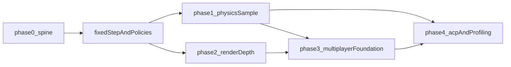

# SDK and samples roadmap

## Audience and intent

This document is for **external C++ teams** and maintainers who treat Marble as a **reusable SDK**, not only as a single game. **Samples** are the primary way to teach integration, stress subsystems, and lock in regression tests. **Gameplay logic** is intentionally **not** the early focus: it lands after simulation, rendering, networking foundations, and tooling paths are solid enough that samples do not churn weekly.

Long-term **north star**: a broader **app and tooling suite**, including **generative / AI-assisted authoring** on top of stable **data schemas and invariants**. That layer must **not** drive low-level engine API shape until those schemas exist; Phases 0–4 stand on their own.

**Gameplay scale note:** eventual targets may include **dense destructible/movable props** and **multiplayer** chaos; replication and simulation budgets usually matter as much as raw graphics/CPU ([`MASTER_PLAN.md`](../MASTER_PLAN.md) §4 *Sample and SDK sequence*).

**Maintainer north-star stress (Dream-style, not a phase gate):** multiplayer spaceship racing from **dense** environments through **atmosphere** to **orbit** stresses **velocity-based interest**, **physics tier handoffs**, and **world streaming** more than a small indoor arena. Consolidated design notes (authoritative vs presentation physics, replication taxonomy template, ordered follow-up engineering steps) live in [`multiplayer-physics-world-scale.md`](multiplayer-physics-world-scale.md). **Phase 3** in the table below remains a **narrow** multiplayer foundation sample; that doc guides **later** scale without expanding Phase 3 scope.

**Marble maintainer focus:** [`MASTER_PLAN.md`](../MASTER_PLAN.md) §1 records **physics**, **universe/world generation**, and **early multiplayer server** (headless/listen/dedicated + transport) as weighted priorities; this repo may **front-run** server work relative to the generic phase table below when sim/world contracts stabilize.

## Design principle

**Simple defaults, powerful escape hatches.** Integrators should see **narrow stable seams** (for example `IRenderBackend`, `ISimulationPhase` / `IRenderPhase`, asset root resolution) and **thick implementations** behind them (`VulkanRhi`, job/render internals). Games may depend on a concrete backend for bootstrap today; the seam documents where a second API or factory would attach.

**Baseline vs full subsystem:** Phases **0–4** do **not** require every engine header family to become a complete production stack at once. Many areas ship first as **tested baselines** (types, math, fixed-capacity structures, ADR-backed contracts). **Linked** engine code concentrates on the **spine**, **Vulkan**, **Jolt** (via `IPhysicsScene`), platform, and input paths until samples and ACP demand more. See [`engine-subsystems.md`](engine-subsystems.md) (*Implementation depth*) for the canonical split.

## Phased build order

Phases overlap in real work; the order encodes **dependencies**, not a strict waterfall.

| Phase | Focus | Notes |
| --- | --- | --- |
| **0** | **Spine** | Engine lifecycle, logging, assets root, tests, compile policy. Close or defer **fixed-step stall policy**, **data ownership**, and **concurrency defaults** when they block samples ([`OPEN_QUESTIONS.md`](../notes/OPEN_QUESTIONS.md)). |
| **1** | **Simulation + physics sample** | First **hero** vertical slice on **fixed-step**: proves time integration, physics/world seam, and something for the renderer to show that is not scripted fakery. |
| **2** | **Render / RHI depth** | Advance in **parallel** once Phase 1 is moving: passes, materials, instancing—only as much as samples need. Not a hard “after physics is done” gate. |
| **3** | **Multiplayer foundation sample** | **Authority model** ([`OnlineMultiplayerFoundation.hpp`](../../engine/gameplay/OnlineMultiplayerFoundation.hpp)), **UDP + wire + session envelope**, **reliable control** (`ReliableChannel`, protocol v2), **`AuthoritativeSession` / `ClientSession`**, and **`mp_foundation`** over real UDP (discovery + session `tick` + snapshots) **landed**. **Landed (narrow):** [`SnapshotInterpolator`](../../engine/gameplay/SnapshotInterpolator.hpp) + tests (not wired to a visual sample). **Still open:** headless dedicated binary, game-loop wiring (garden/marbles), render-clock mapping + prediction/correction, interest management, platform services / NAT. |
| **4** | **Asset pipeline, profiling, platform breadth** | ACP, packs, importers; profiling gates in CI or documented thresholds; **PC-first** and Vulkan-first are acceptable; second graphics API and full platform matrix can wait. |
| **5** | **Gameplay / app-shell** | Higher-level flow, UI, scripting—when lower layers churn less. |
| **6** | **Tooling / generative / AI-assisted** | Productivity and content generation on top of **stable** entity/level/behavior **data** contracts. Explicitly **non-blocking** for Phases 0–4. |

### Depth expectations (what phases do *not* gate yet)

Use this as a sanity check against “is the engine hollow?”: **no** — large parts are **deliberately shallow until a phase pulls them forward.**

- **Phases 0–2:** Do **not** assume OS audio streaming, a script VM, or **complete** multiplayer stack must land before physics/render samples progress.
- **Phase 3:** A **first UDP + framing + sample** path exists; the phase still targets **narrow** replication (tick-aligned authority + small state), **not** production netcode (full prediction, interest sets, NAT, platform services). Prioritized follow-ups: [`multiplayer-physics-world-scale.md`](multiplayer-physics-world-scale.md) § *Next engineering steps*.
- **Phase 4:** ACP and profiling **before** treating content tooling as complete.
- **Phase 5+:** **Thick** gameplay, UI, and scripting implementations accelerate here; baselines from earlier chunks supply contracts to build on.

## Dependency sketch

## Cross-platform

- **Defer** full multi-OS CI, second graphics API, and console/mobile matrices if bandwidth requires it.
- **Do not defer** portable **core** habits: filesystem and path abstraction, **endian-safe** serialization for anything that might cross the wire, a clear **threading contract** for engine entry points, and avoiding Windows-only types in **public** engine headers.
- **`platform::executableDirectory()`** has Linux and macOS implementations alongside Windows; **validate on real hosts or CI** when available (Windows-only validation is insufficient).

## How external teams get this documentation

The **`docs/`** tree is **gitignored** in the default Marble repository layout (see repo [`.gitignore`](../../.gitignore)); many clones are **code-first**. Integrators therefore need an explicit **delivery path**: maintainer checkout with `docs/`, a published tarball, or a future on-repo/public doc policy. See **publishing `docs/`** in [`OPEN_QUESTIONS.md`](../notes/OPEN_QUESTIONS.md) and **public API / versioning** in the same file for SDK-ready milestones.

## Garden sample (physics expectations)

The `garden` executable is a **large-yard** showcase: collision is dominated by **pre-baked static AABBs** plus a **log-only gravity settle** at load. **Runtime** motion for the two footballs is **Jolt** via the engine [`IPhysicsScene`](../../engine/physics/IPhysicsScene.hpp) against that static scene; many dynamic props or arbitrary rigid-body stacks remain follow-up on the same middleware path.

Details: [`ADR-0058`](../decisions/ADR-0058-physics-middleware-integration.md).

## Related canonical docs

- Priorities snapshot: [`MASTER_PLAN.md`](../MASTER_PLAN.md)
- Open decisions: [`notes/OPEN_QUESTIONS.md`](../notes/OPEN_QUESTIONS.md)
- Subsystem map: [`engine-subsystems.md`](engine-subsystems.md)
- Multiplayer-first physics/world scale (planning): [`multiplayer-physics-world-scale.md`](multiplayer-physics-world-scale.md)
- Architecture guardrails: [`../guardrails/architecture-guardrails.md`](../guardrails/architecture-guardrails.md)
